# 🏭 العرض الفني والمالي - نظام تخطيط موارد المؤسسات الشامل (Smart Factory ERP)
## الإصدار الأقوى للشركات والمصانع الكبرى (Enterprise Ultimate Edition)

---

## 🔴 المشكلة الأساسية في الإدارة التقليدية وتأثيرها المدمر

قبل تطبيق هذا النظام، كانت المصانع تدار بطرق تقليدية ومستندات ورقية، وجداول إكسيل، ومجموعات واتساب متفرقة. أدى هذا إلى نزيف مستمر في الموارد والأموال:

| المشكلة | التأثير الكارثي |
|:---|:---|
| **تتبع الحضور الورقي واليدوي** | تلاعب مستمر في كشوف الحضور، وتوقيع الموظفين لبعضهم البعض، وعدم وجود دليل فعلي على التأخيرات أو الغياب، مما يكلف الشركة آلاف الجنيهات مهدرة شهرياً. |
| **غياب التتبع المالي الدقيق** | إنفاق الأموال (سلف، عهد، مشتريات نقدية) دون محاسبة واضحة أو تتبع لمسارات الصرف من الخزنة والبنك، وتأخر تسويات المندوبين. |
| **عشوائية المخازن والجرد اليدوي** | ضياع المواد الخام، وتوقف خطوط الإنتاج فجأة بسبب نقص الخامات غير المحسوب، وعدم معرفة الأرصدة الحقيقية إلا بعد جرد يدوي مرهق. |
| **الإنتاج العشوائي** | بدء التصنيع دون خطط مسبقة، ودون التأكد من توافر الخامات، مما يؤدي إلى هدر في المواد وتأخر في التسليم للعملاء. |
| **غياب رقابة الجودة الصارمة** | قبول خامات معيبة من الموردين، أو وصول منتجات رديئة للعملاء، مما يؤدي إلى زيادة المرتجعات، الخسائر المادية، وتشويه سمعة المصنع. |

> **النتيجة: النظام القديم يجعل الشركة تفقد الأموال، الوقت، وثقة العملاء؛ لأنه لا يوجد نظام واحد يربط كل هذه الجزر المنعزلة.**

---

## 🟢 الحل الجذري: نظام Smart Factory ERP

نظام **المصنع الذكي** يربط **كل أقسام وإدارات الشركة (مهما كبرت أو صغرت)** في تطبيق ويب واحد بحيث:
- يتم **تسجيل وتوثيق كل إجراء وكل رقم في قاعدة البيانات** بشكل لحظي.
- يمتلك كل موظف **دوراً محدداً بصلاحيات صارمة** (أمين المخزن لا يرى الرواتب، والمحاسب لا يسلم بضاعة من المخزن).
- تتدفق كل خطوة **تلقائياً وبذكاء** (طلب المبيعات يُسمّع في التخطيط، والتخطيط في المشتريات والمخازن).
- يرى المدير العام ومالك الشركة **كل صغيرة وكبيرة في الشركة من شاشة واحدة**.

---

## 🔄 التفاصيل الشاملة لدورات العمل (12 نظاماً متكاملاً)

### 1. 👥 قسم الموارد البشرية والرواتب (Core HR & Payroll)

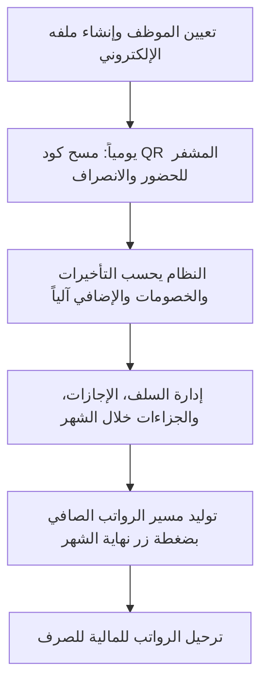

**كل ما يشمله القسم (صغير وكبير):**
- **الحضور بالـ QR المشفر:** يتغير كل 5 ثوانٍ، ومزود بتتبع جغرافي لمنع تسجيل الحضور من المنزل.
- **حساب الراتب المعقد آلياً:** (الأساسي + الإضافي + البدلات - تأخيرات - سلف - غياب - جزاءات).
- **إدارة الإجازات بالكامل:** (اعتيادي، عارضة، مرضي، وضع، وغيرها) مع خصم آلي من الرصيد السنوي.
- **إدارة السلف (Loans):** طلب السلفة ← موافقة الإدارة ← الخصم التلقائي كأقساط شهرية من الراتب دون تدخل بشري.
- **نظام الجزاءات والإنذارات المتدرج:** (لفت نظر شفهي، إنذار كتابي، إنذار نهائي، إيقاف عن العمل، فصل نهائي) مع الربط بخصومات الراتب.
- **تقييم الأداء (KPIs):** تقييم شهري بـ 5 نجوم (حضور، جودة، تعاون، مبادرة، تواصل).
- **إدارة العهد المادية:** تتبع ما يستلمه الموظف (لابتوب، سيارة، موبايل، زي رسمي) لضمان استرداده عند الاستقالة.
- **التدريب والتطوير:** جدولة الدورات التدريبية وتتبع حضور الموظفين.
- **الشيفتات الذكية:** نظام يفرق تلقائياً بين الموظف الإداري (9 الصبح إلى 5 العصر) وموظف المصنع والعامل.

---

### 2. 💰 القسم المالي والخزينة (Finance & Treasury)

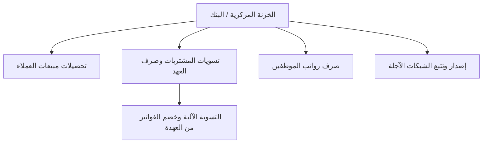

**كل ما يشمله القسم:**
- **شاشة الخزينة الحية:** رؤية السيولة النقدية في الخزنة والبنك في ذات اللحظة.
- **التحويلات الداخلية:** نقل النقدية بين البنك والخزنة مع إثبات القيود.
- **دورة تسوية العهد الصارمة:** صرف عهدة للمندوب ← يشتري ويرفع الفاتورة ← النظام يسوي الفاتورة ويحسب المتبقي للمندوب أو المستحق له.
- **دورة الشيكات المؤجلة:** تسجيل الشيك بتاريخ استحقاقه، ويبقى "معلقاً" حتى يحل موعده ليتم صرفه وإضافته للخزنة أو خصمه.
- **التقارير الختامية:** قائمة الدخل (أرباح وخسائر P&L)، الميزانية العمومية، وتدفقات النقد.
- **سجل نشاط المستخدمين (Audit Log):** تتبع كل ضغطة زر يقوم بها أي موظف في النظام (من عدّل؟ متى؟ وماذا كان الرقم القديم؟).

---

### 3. 📦 قسم المبيعات وتسليم العملاء (Sales)

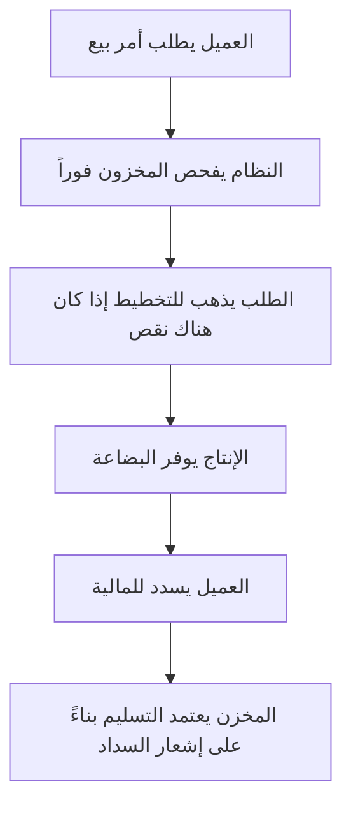

**كل ما يشمله القسم:**
- **أوامر البيع الذكية:** لا يتم الاعتماد إلا بعد فحص الأرصدة المخزنية.
- **حلول النواقص للعميل:** إذا كانت البضاعة ناقصة، يمكن للعميل اختيار: (استلام المتاح حالياً جزئياً - أو الانتظار - أو إلغاء الطلب).
- **دورة التسليم المؤمنة 100%:** أمين المخزن لا يستطيع ولا يملك صلاحية تسليم "مسمار واحد" للعميل إلا إذا تغيرت حالة الطلب إلى "تم الدفع" من الإدارة المالية.
- **إثبات التسليم:** تسجيل الرقم القومي للعميل أو المندوب المستلم لحفظ الحقوق.

---

### 4. 📋 قسم التخطيط والمراقبة (Planning)

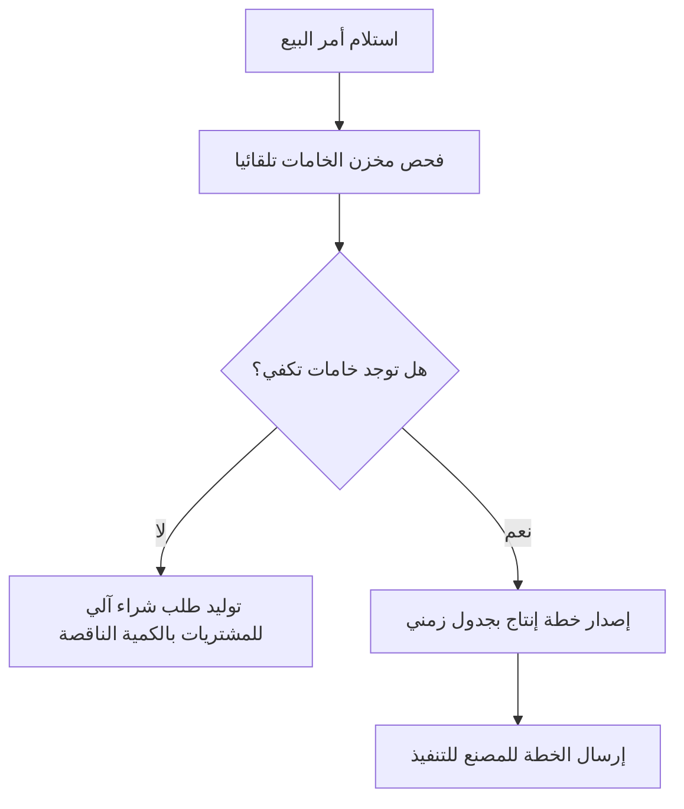

**كل ما يشمله القسم:**
- **العقل المدبر للمصنع:** هو الوسيط الذي يحمي المصنع من التوقف، يقرأ طلب المبيعات ويحوله إلى خطة إنتاج مبرمجة زمنياً.
- **طلبات الشراء الآلية:** إذا اكتشف نقصاً في المخزن، لا ينتظر، بل يرسل طلب شراء أوتوماتيكي لقسم المشتريات وفيه الصنف والكمية الناقصة بالضبط.

---

### 5. 🏭 قسم الإنتاج والتصنيع (Production)

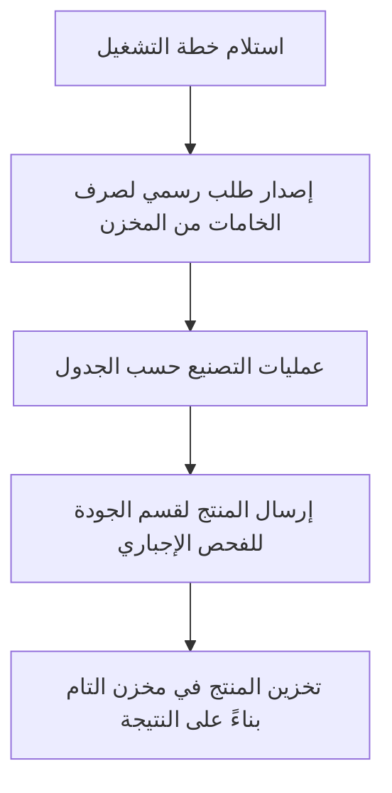

**كل ما يشمله القسم:**
- **حماية الخامات:** لا يمكن للإنتاج سحب أي خامة عشوائياً، يجب إصدار طلب صرف (Material Request) يوافق عليه المخزن.
- **متابعة حالات الإنتاج:** (جاري العمل، مكتمل، تحت الفحص).
- **الإجبار على الجودة:** النظام لا يسمح للإنتاج بإدخال بضاعته لمخزن "المنتج التام" للبيع، بل يجبره على إرسالها لقسم الجودة أولاً.

---

### 6. ✅ قسم رقابة الجودة (Quality Control)

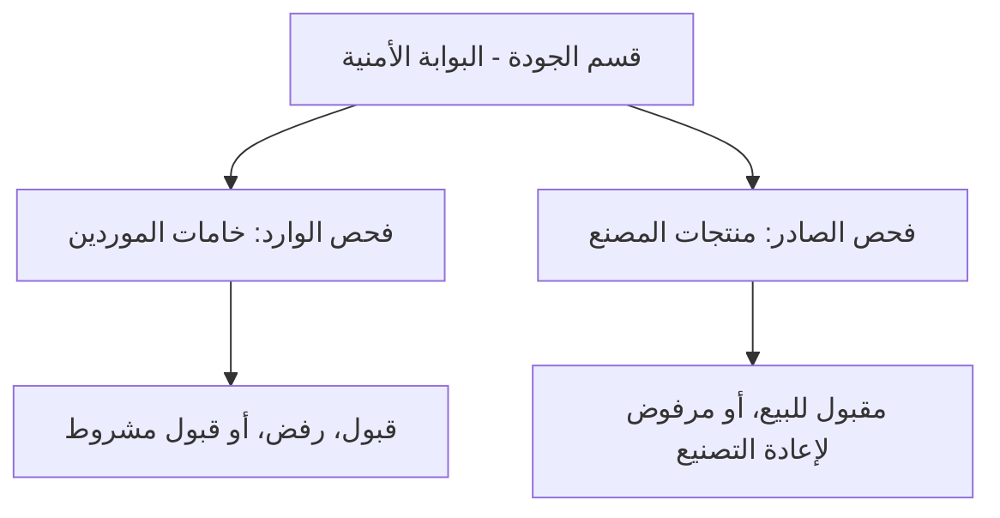

**كل ما يشمله القسم:**
- **الفحص الوارد (Incoming QC):** فحص خامات الموردين قبل التخزين لضمان عدم دخول مواد رديئة تتلف الإنتاج.
- **الفحص الصادر (Finished Goods QC):** فحص المنتج النهائي قبل ذهابه للعميل.
- **إدارة المرفوضات:** في حال رفض منتج، يذهب إما لإعادة التصنيع (Rework) أو يتم إعدامه وتسجيله كخسائر (Scrap).

---

### 7. 🏪 إدارة المخازن (Warehouse & Inventory)

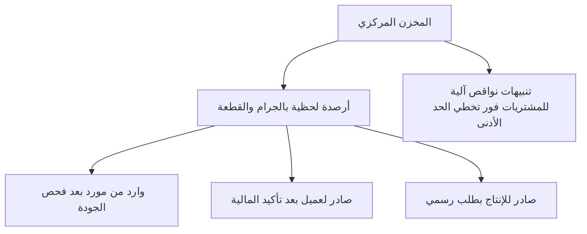

**كل ما يشمله القسم:**
- **تتبع فوري (Live Stock):** لكل جرام وقطعة.
- **تنبيهات النواقص الآلية:** يرسل النظام إنذاراً للمشتريات بمجرد اقتراب صنف معين من الانتهاء (الحد الأدنى الآمن).
- **التخزين المتعدد:** دعم مخزن الخامات (Raw Materials) ومخزن المنتجات التامة (Finished Goods).

---

### 8. 🛒 المشتريات والموردين (Procurement)

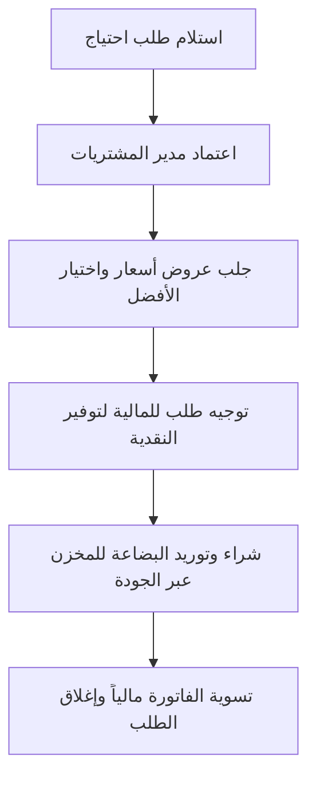

**كل ما يشمله القسم:**
- **دورة اعتمادات:** أي موظف يطلب احتياج ← يوافق عليه مديره ← يذهب للمشتريات.
- **عروض الأسعار والتنافسية:** إجبار المشتريات على إدخال أكثر من عرض سعر لاختيار الأرخص والأفضل.
- **الربط مع الحسابات:** فور الشراء يتم رمي التسوية على حسابات العهد لضمان عدم إهدار أموال الشركة.

---

### 9. 🔧 الإدارة الهندسية وقطع الغيار (Engineering)

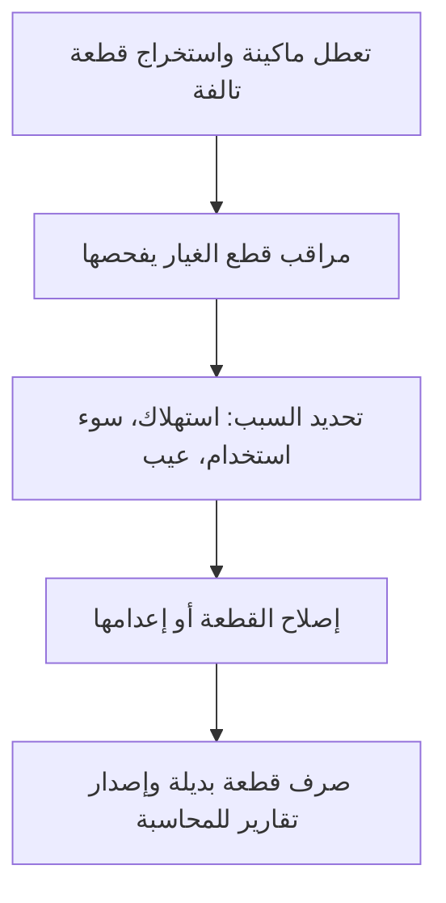

**كل ما يشمله القسم:**
- **إيقاف إهدار قطع الغيار:** العامل لا يأخذ قطعة غيار جديدة إلا بتسليم القديمة التالفة.
- **فحص القطع التالفة:** تحديد المتسبب في التلف لخصم ثمنها منه إذا كان سوء استخدام.
- **أرشيف التصميمات:** حفظ وتوثيق لوحات وتصميمات المشاريع والماكينات الهندسية.

---

### 10. 💻 قسم الدعم الفني والأعطال (IT Support)

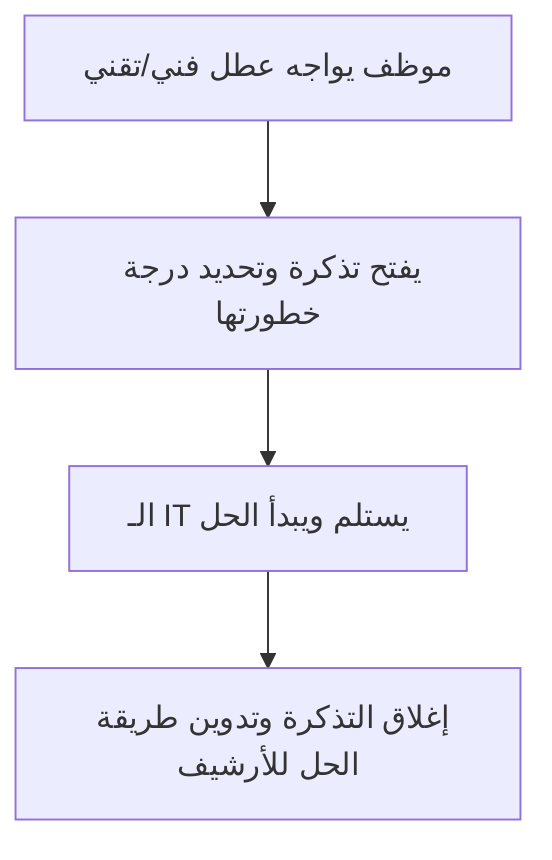

**كل ما يشمله القسم:**
- **نظام التذاكر (Ticketing):** تصنيف الأعطال (هاردوير، شبكات، برمجيات) وتحديد الأولويات.
- **بناء أرشيف معرفي:** لضمان عدم تكرار المشكلة وسهولة حلها مستقبلاً.

---

### 11. 🤖 موديولات الذكاء الاصطناعي (AI Suite)

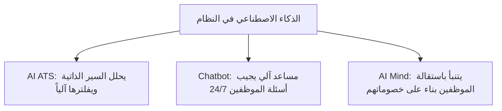

**كل ما يشمله القسم:**
- **توظيف ذكي:** لا داعي لقراءة 1000 سيرة ذاتية، الذكاء الاصطناعي يقرأ الـ PDF ويعطي المتقدم تقييم من 100%.
- **روبوت المحادثة (Chatbot):** الموظف يسأل الروبوت في أي وقت "ما هو رصيد إجازاتي؟" أو "كم راتبي هذا الشهر؟" ويجيبه فوراً بدلاً من إشغال الـ HR.

---

### 12. 💬 التعاون وبيئة العمل (Collaboration)

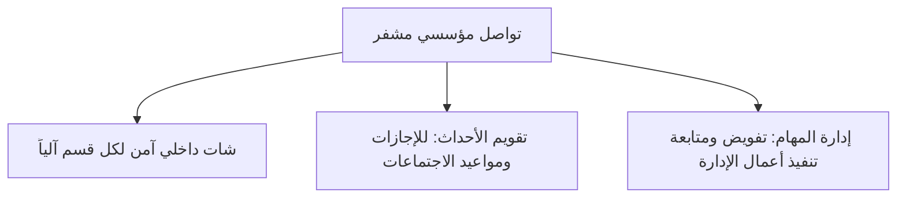

**كل ما يشمله القسم:**
- **شات داخلي (Internal Chat):** الاستغناء التام عن الواتساب الشخصي، الشات مفصول لكل قسم (أنت تتحدث مع مديرك وزملائك فقط) بينما الإدارة العليا والـ HR يرون الجميع.
- **تقويم الأحداث والمهام:** إدارة كاملة لوقت المؤسسة وإنتاجيتها.
- **دعم اللغتين:** النظام بالكامل يعمل باللغة العربية والإنجليزية، واللغة الافتراضية هي العربية.

---

### 13. 🚚 قسم حركة السيارات وأسطول النقل (Fleet & Logistics)

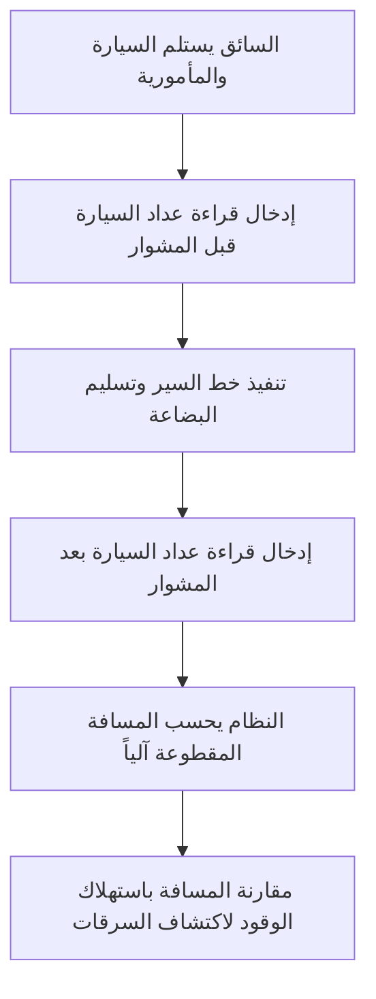

**كل ما يشمله القسم:**
- **تسجيل قراءة العداد (Odometer Tracking):** إجبار السائق على تصوير/إدخال قراءة العداد قبل وبعد كل مشوار لحساب الكيلومترات الفعلية بدقة وتخزينها في قاعدة البيانات.
- **تتبع الوقود والصيانة:** تسجيل كل لتر بنزين ومقارنته بالمسافة المقطوعة لاكتشاف السرقات.
- **تنبيهات التراخيص:** إنذار آلي قبل انتهاء رخصة السيارة أو السائق بشهر.
- **إدارة خطوط السير:** ربط خط سير المندوب بأوامر التسليم المخزنية.

---

### 14. 🎯 قسم علاقات العملاء والتسويق (CRM & Leads)

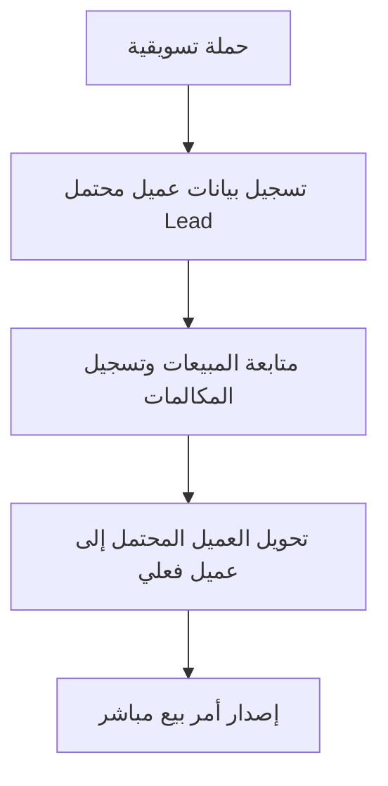

**كل ما يشمله القسم:**
- **خطوط البيع (Pipeline):** تتبع العميل من أول مكالمة حتى إتمام البيع.
- **تسجيل التفاعلات:** حفظ ملخص كل مكالمة أو اجتماع مع العميل.
- **تقييم موظفي المبيعات:** معرفة من يحقق التارجت ومن يفقد العملاء.

---

### 15. 📊 ذكاء الأعمال ولوحة تحكم الإدارة العليا (Business Intelligence)

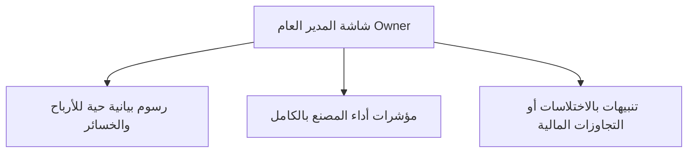

**كل ما يشمله القسم:**
- **شاشة عين الصقر:** رؤية شاملة لمبيعات اليوم، نقدية البنك، نواقص المخزن، وغياب الموظفين في شاشة واحدة.
- **تقارير متقاطعة (Cross-Reports):** مثلاً مقارنة تكلفة رواتب قسم الإنتاج بحجم الإنتاج الفعلي.
- **تنبيهات أمنية للإدارة:** إشعار فوري على هاتف المدير إذا حاول موظف صرف مبلغ غير معتمد.

---
---

# 💳 العرض المالي والاستثماري (Price Quotation)

### التكلفة الاستثمارية ونطاق التعاقد للإصدار الشامل (Enterprise Ultimate Edition)

| البند والوصف | القيمة (ج.م) |
|:---|:---|
| **رخصة النظام الشامل (Enterprise Lifetime License)** ملكية تامة للنسخة - عدد مستخدمين غير محدود - شامل جميع الـ 15 نظام متكامل | 1,200,000 |
| **إعداد البنية التحتية والسيرفرات (Setup & Deployment)** تهيئة قواعد البيانات السحابية المؤمنة وأنظمة النسخ الاحتياطي السريع | 150,000 |
| **تطوير ودمج خوارزميات الذكاء الاصطناعي (AI Integration)** المساعد الآلي وتحليل الـ CVs والتنبؤ بسلوك الموظفين | 150,000 |
| **التدريب الميداني والدعم الفني** تدريب جميع الموظفين في المصنع على استخدام النظام | مجاناً (Included) |
| **إجمالي التكلفة الاستثمارية (مليون ونصف المليون جنيه مصري)** | **1,500,000 ج.م** |

#### 📌 شروط وأحكام التعاقد:
1. **الرخصة:** بيع نهائي (ملكية تامة) كأصل من أصول الشركة، بدون أي اشتراكات شهرية أو سنوية على استخدام النظام، وبدون حد أقصى لعدد الموظفين أو المعاملات.
2. **الدعم والصيانة:** التزام بضمان فني كامل ودعم تقني على مدار الساعة لمدة عام كامل (12 شهراً) من تاريخ التشغيل الفعلي مجاناً.
3. **طريقة الدفع:** 
   - 50% دفعة تعاقد وبدء العمل.
   - 25% عند الانتهاء من التجهيز المبدئي ورفع النظام على السيرفرات.
   - 25% عند التسليم والتشغيل النهائي وتدريب الموظفين واستلامهم لكلمات المرور.
4. **صلاحية العرض:** هذا العرض ملزم مالياً وفنياً وساري لمدة 15 يوماً من تاريخ الإصدار.
