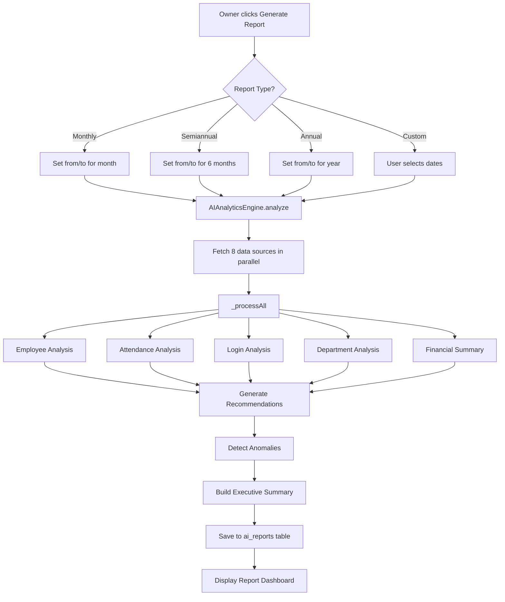
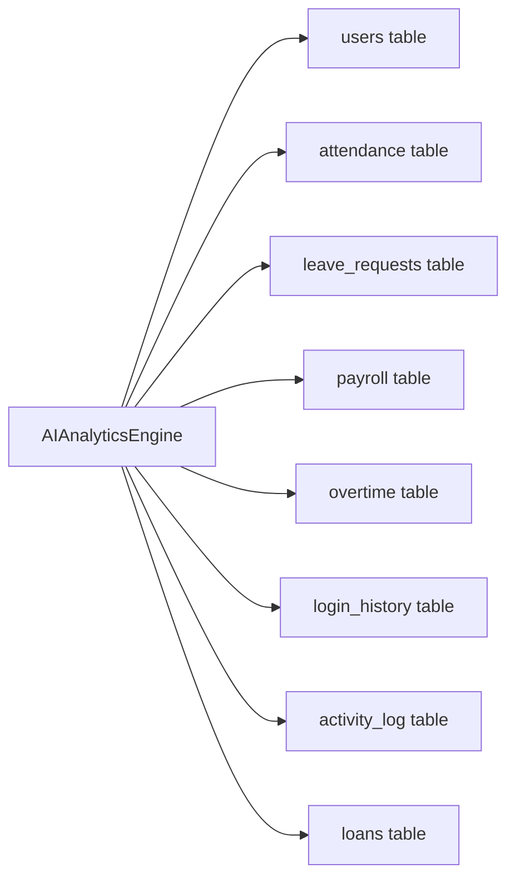
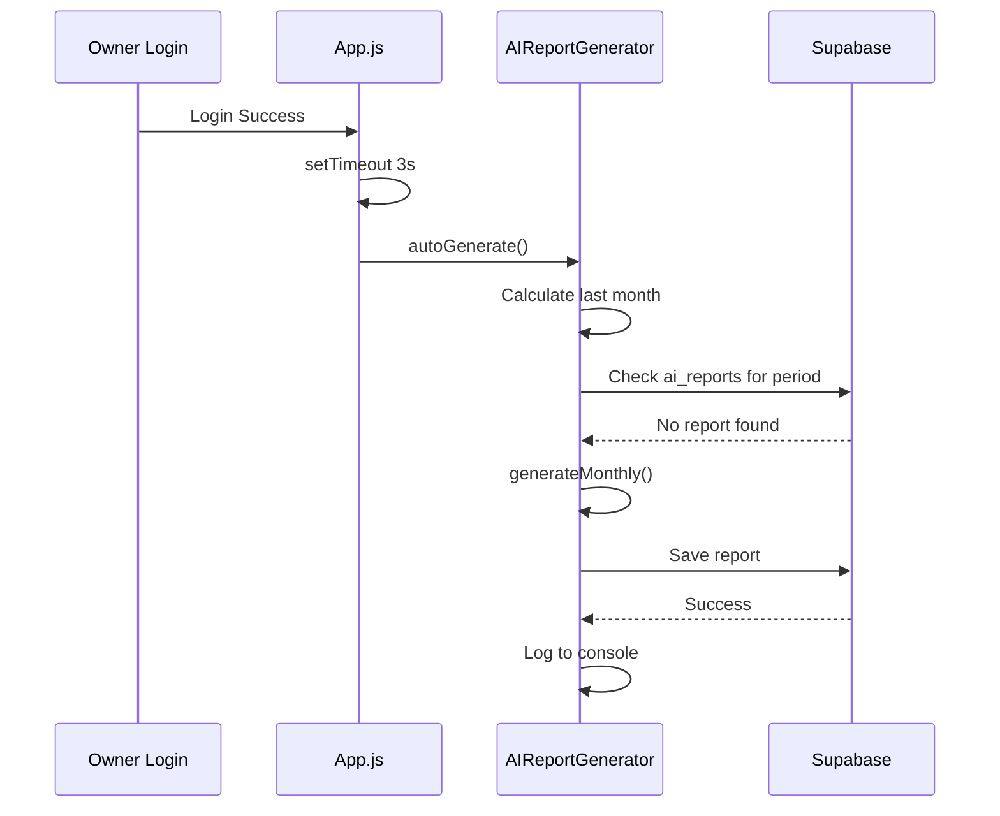

# Owner AI Analytics Flow

## Report Generation Pipeline

```mermaid
flowchart TD
    A[Owner clicks Generate Report] --> B{Report Type?}
    B -->|Monthly| C[Set from/to for month]
    B -->|Semiannual| D[Set from/to for 6 months]
    B -->|Annual| E[Set from/to for year]
    B -->|Custom| F[User selects dates]
    C --> G[AIAnalyticsEngine.analyze]
    D --> G
    E --> G
    F --> G
    G --> H[Fetch 8 data sources in parallel]
    H --> I[_processAll]
    I --> J[Employee Analysis]
    I --> K[Attendance Analysis]
    I --> L[Login Analysis]
    I --> M[Department Analysis]
    I --> N[Financial Summary]
    J --> O[Generate Recommendations]
    K --> O
    L --> O
    M --> O
    N --> O
    O --> P[Detect Anomalies]
    P --> Q[Build Executive Summary]
    Q --> R[Save to ai_reports table]
    R --> S[Display Report Dashboard]
```

## Data Sources

```mermaid
flowchart LR
    A[AIAnalyticsEngine] --> B[users table]
    A --> C[attendance table]
    A --> D[leave_requests table]
    A --> E[payroll table]
    A --> F[overtime table]
    A --> G[login_history table]
    A --> H[activity_log table]
    A --> I[loans table]
```

## Auto-Generation on Owner Login

```mermaid
sequenceDiagram
    participant Owner as Owner Login
    participant App as App.js
    participant Gen as AIReportGenerator
    participant DB as Supabase

    Owner->>App: Login Success
    App->>App: setTimeout 3s
    App->>Gen: autoGenerate()
    Gen->>Gen: Calculate last month
    Gen->>DB: Check ai_reports for period
    DB-->>Gen: No report found
    Gen->>Gen: generateMonthly()
    Gen->>DB: Save report
    DB-->>Gen: Success
    Gen->>Gen: Log to console
```
