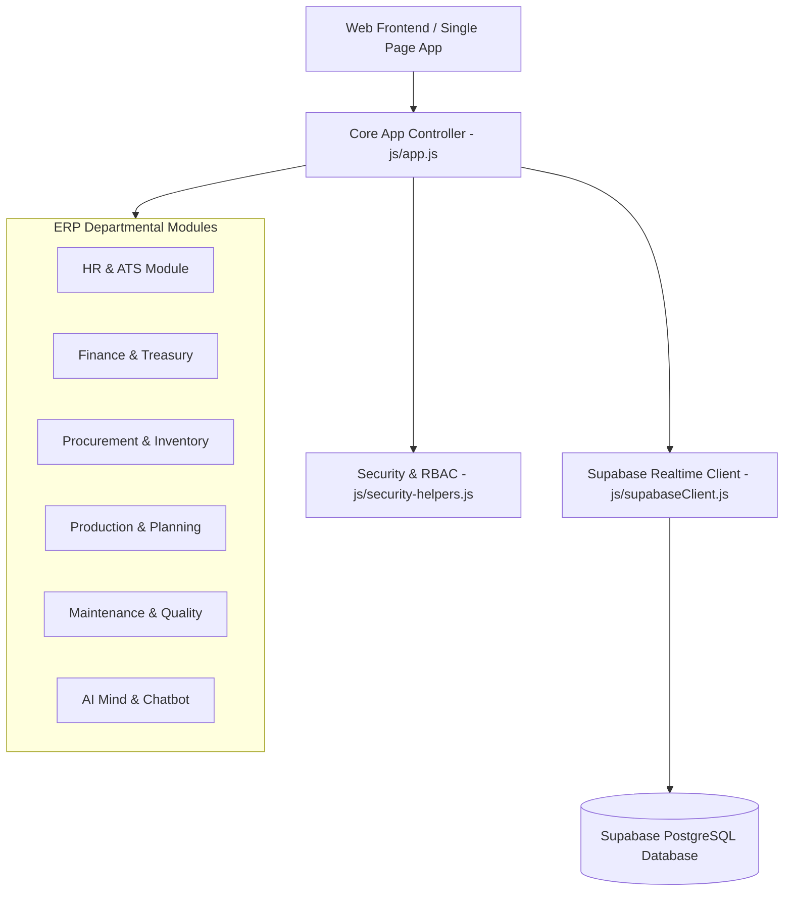

# Enterprise ERP System Architecture

## Overview
The Smart Factory HR & Enterprise Resource Planning (ERP) System is built as a highly modular, real-time, bilingual (Arabic/English) enterprise application.

## Architectural Layers
1. **Presentation & UI Layer**: Standard HTML5, CSS3, Vanilla JS, and Chart.js components.
2. **Controller & Router**: SPA Navigation driven by `App.navigate(page)` and dynamic view rendering.
3. **Domain Modules Layer**: Self-contained module files handling business rules for HR, Finance, Procurement, Production, Quality, Logistics, Fleet, and Maintenance.
4. **Security & Permission Layer**: Dynamic database-backed RBAC with per-screen view, add, edit, and delete permissions (`SecurityHelpers.hasPermission`).
5. **Data & Persistence Layer**: Supabase Client managing PostgreSQL database queries, authentication, storage, and realtime subscriptions.
