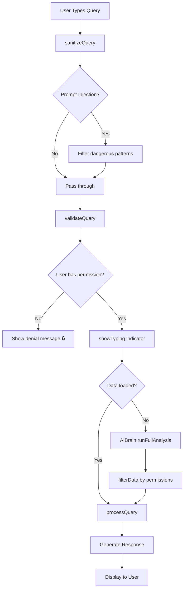
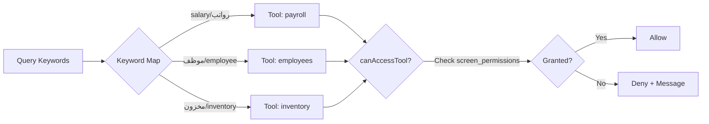
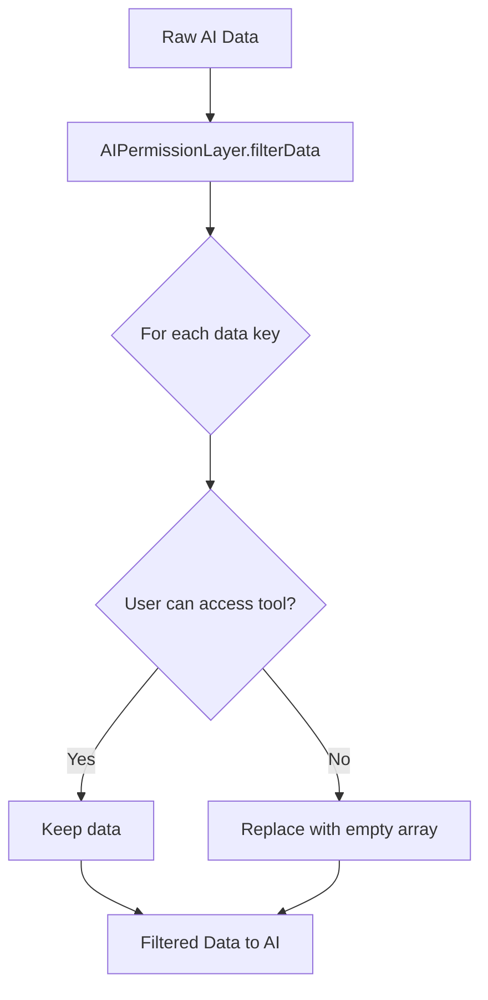

# AI Chatbot Security Flow

## Query Processing Pipeline

```mermaid
flowchart TD
    A[User Types Query] --> B[sanitizeQuery]
    B --> C{Prompt Injection?}
    C -->|Yes| D[Filter dangerous patterns]
    C -->|No| E[Pass through]
    D --> E
    E --> F[validateQuery]
    F --> G{User has permission?}
    G -->|No| H[Show denial message 🔒]
    G -->|Yes| I[showTyping indicator]
    I --> J{Data loaded?}
    J -->|No| K[AIBrain.runFullAnalysis]
    J -->|Yes| L[processQuery]
    K --> M[filterData by permissions]
    M --> L
    L --> N[Generate Response]
    N --> O[Display to User]
```

## Permission Check Detail

```mermaid
flowchart LR
    A[Query Keywords] --> B{Keyword Map}
    B -->|salary/رواتب| C[Tool: payroll]
    B -->|موظف/employee| D[Tool: employees]
    B -->|مخزون/inventory| E[Tool: inventory]
    C --> F{canAccessTool?}
    D --> F
    E --> F
    F -->|Check screen_permissions| G{Granted?}
    G -->|Yes| H[Allow]
    G -->|No| I[Deny + Message]
```

## Data Filtering

```mermaid
flowchart TD
    A[Raw AI Data] --> B[AIPermissionLayer.filterData]
    B --> C{For each data key}
    C --> D{User can access tool?}
    D -->|Yes| E[Keep data]
    D -->|No| F[Replace with empty array]
    E --> G[Filtered Data to AI]
    F --> G
```
