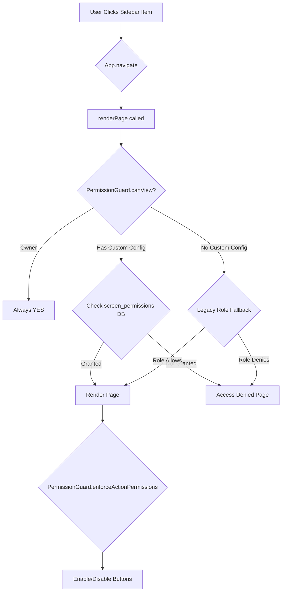
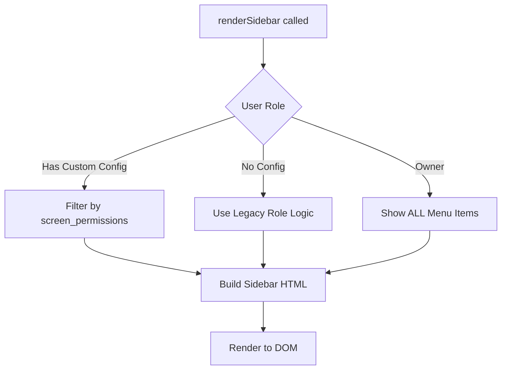
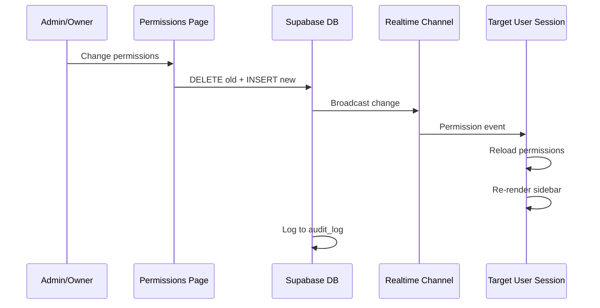
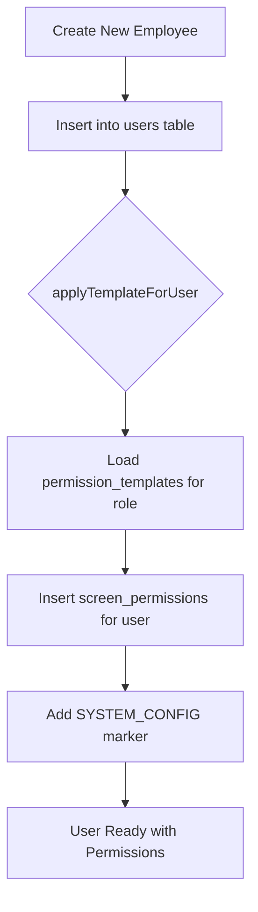

# Permission Flow Diagram

## Screen Access Flow

```mermaid
flowchart TD
    A[User Clicks Sidebar Item] --> B{App.navigate}
    B --> C[renderPage called]
    C --> D{PermissionGuard.canView?}
    D -->|Owner| E[Always YES]
    D -->|Has Custom Config| F{Check screen_permissions DB}
    D -->|No Custom Config| G{Legacy Role Fallback}
    F -->|Granted| H[Render Page]
    F -->|Not Granted| I[Access Denied Page]
    G -->|Role Allows| H
    G -->|Role Denies| I
    H --> J{PermissionGuard.enforceActionPermissions}
    J --> K[Enable/Disable Buttons]
```

## Sidebar Visibility Flow

```mermaid
flowchart TD
    A[renderSidebar called] --> B{User Role}
    B -->|Owner| C[Show ALL Menu Items]
    B -->|Has Custom Config| D[Filter by screen_permissions]
    B -->|No Config| E[Use Legacy Role Logic]
    D --> F[Build Sidebar HTML]
    E --> F
    C --> F
    F --> G[Render to DOM]
```

## Permission Change Flow

```mermaid
sequenceDiagram
    participant Admin as Admin/Owner
    participant UI as Permissions Page
    participant DB as Supabase DB
    participant RT as Realtime Channel
    participant Target as Target User Session

    Admin->>UI: Change permissions
    UI->>DB: DELETE old + INSERT new
    DB->>RT: Broadcast change
    RT->>Target: Permission event
    Target->>Target: Reload permissions
    Target->>Target: Re-render sidebar
    DB->>DB: Log to audit_log
```

## New User Permission Setup

```mermaid
flowchart TD
    A[Create New Employee] --> B[Insert into users table]
    B --> C{applyTemplateForUser}
    C --> D[Load permission_templates for role]
    D --> E[Insert screen_permissions for user]
    E --> F[Add SYSTEM_CONFIG marker]
    F --> G[User Ready with Permissions]
```
