# 🏭 النظام الشامل لتخطيط موارد المؤسسات (Smart Factory ERP)
## تحليل المشاكل والحلول المبتكرة — دورة العمل الكاملة لكل الأقسام

---

## 🔴 المشكلة الأساسية في الإدارة التقليدية

قبل تطبيق هذا النظام، كان المصنع يدار بطرق تقليدية ومستندات ورقية، وجداول إكسيل، ومجموعات واتساب متفرقة. أدى هذا إلى:

| المشكلة | التأثير الكارثي |
|:---|:---|
| **عدم وجود بيانات مركزية** | الموارد البشرية (HR) لم تكن قادرة على تتبع من يعمل، أو من يغيب، أو من في إجازة، مما يسبب فوضى إدارية. |
| **تتبع الحضور الورقي** | تلاعب في كشوف الحضور، وتوقيع الموظفين لبعضهم البعض، وعدم وجود دليل فعلي على التأخيرات. |
| **حساب الرواتب يدوياً** | أخطاء بشرية فادحة في الرواتب، وتذمر مستمر من الموظفين بسبب الخصومات غير الدقيقة. |
| **غياب التتبع المالي** | إنفاق الأموال (السلف، العهد، المشتريات) دون محاسبة واضحة أو تتبع لمسارات الصرف من الخزنة والبنك. |
| **الجرد اليدوي للمخازن** | ضياع المواد الخام، وتوقف خطوط الإنتاج بسبب نقص الخامات المفاجئ غير المحسوب. |
| **التواصل عبر الواتساب** | ضياع الرسائل، وتداخل الطلبات الشخصية مع العمل، وعدم وجود سجل رسمي للمحاسبة. |
| **الإنتاج العشوائي** | بدء الإنتاج دون خطط مسبقة بناءً على المبيعات ودون التأكد من توافر الخامات. |
| **غياب رقابة الجودة** | وصول منتجات معيبة للعملاء، وزيادة المرتجعات والخسائر المادية، وتشويه سمعة المصنع. |

> **النتيجة: كان المصنع ينزف الأموال والوقت ويفقد ثقة العملاء لأنه لم يكن هناك نظام واحد مترابط يربط كل هذه الجزر المنعزلة.**

---

## 🟢 الحل الجذري: نظام ERP موحد ومترابط

نظام **المصنع الذكي (Smart Factory ERP)** يربط **كل قسم** في تطبيق ويب واحد بحيث:
- يتم **تسجيل وتوثيق كل إجراء في قاعدة البيانات** بشكل لحظي.
- يمتلك كل موظف **دوراً محدداً بصلاحيات معينة** تمنع التداخل (لا يمكن لأمين المخزن أن يصرف راتباً، ولا للمحاسب أن يستلم بضاعة).
- تتدفق كل خطوة **تلقائياً وبذكاء** من قسم إلى آخر (المبيعات تُسمّع في التخطيط، والتخطيط في المشتريات والإنتاج).
- يرى المدير العام ومالك الشركة **كل صغيرة وكبيرة** عبر لوحة تحكم إدارية عليا (Owner Dashboard).

---

## 🔄 دورات العمل المكتملة لكل قسم

### 1. 👥 قسم الموارد البشرية (HR)

#### المشكلة سابقاً:
حفظ ملفات الموظفين ورقياً، حساب الحضور والرواتب والإجازات في إكسيل مسبب للأخطاء والنزاعات المستمرة. عدم وجود تقييم حقيقي للأداء أو تتبع للعهد.

#### كيف يحل النظام المشكلة:

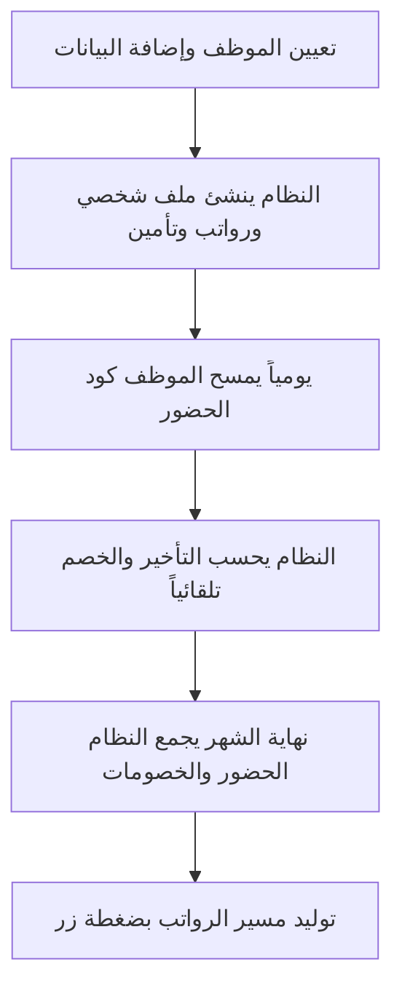

#### المميزات الحصرية للموارد البشرية:
- **نظام الحضور المشفر:** يتحدث كل **5 ثوانٍ** ليمنع تصويره.
- **حساب التأخير التلقائي:** (تأخير 15 دقيقة = خصم ربع يوم، ساعتين = خصم نصف يوم).
- **إدارة الإجازات:** طلب إلكتروني، موافقة إدارية، خصم تلقائي من الرصيد.
- **تقييم الأداء والجزاءات:** تقييم من 5 نجوم (حضور، جودة، مبادرة) وتدرج في الجزاءات.

---

### 2. 💰 القسم المالي والحسابات (Finance)

#### المشكلة سابقاً:
حسابات الخزنة والبنك غير دقيقة، السلف تصرف بلا تتبع، شيكات بلا مواعيد واضحة.

#### كيف يحل النظام المشكلة:

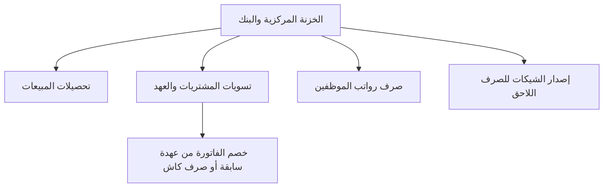

#### المميزات الحصرية للمالية:
- **شاشة الخزينة:** رؤية أرصدة الخزنة والبنك وتدفقاتها لحظة بلحظة.
- **التحويلات وتسويات الشراء:** ربط طلبات الشراء تلقائياً وتحديد إن كانت تخصم من عهدة سابقة أم تصرف كاش.
- **الشيكات المؤجلة:** إصدار الشيكات وإبقاؤها معلقة حتى حلول تاريخ الاستحقاق لتصرف من البنك.

---

### 3. 📦 قسم المبيعات (Sales)

#### المشكلة سابقاً:
طلبات ورقية عشوائية، والمندوب لا يعلم هل البضاعة متاحة أم لا.

#### كيف يحل النظام المشكلة:

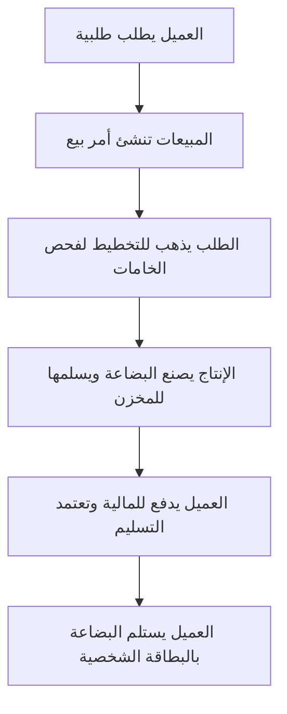

#### المميزات الحصرية للمبيعات:
- **الاستعلام الآلي عن المخزون:** التأكد من توافر الخامات قبل تأكيد البيع.
- **التسليم المؤمن:** لا يمكن لأمين المخزن تسليم بضاعة لعميل إلا بعد اعتماد الإدارة المالية.

---

### 4. 📋 قسم التخطيط (Planning)

#### المشكلة سابقاً:
توقف الإنتاج باستمرار لعدم وجود خامات، ولا يوجد رابط بين طلبات المبيعات وسحب المخزون.

#### كيف يحل النظام المشكلة:

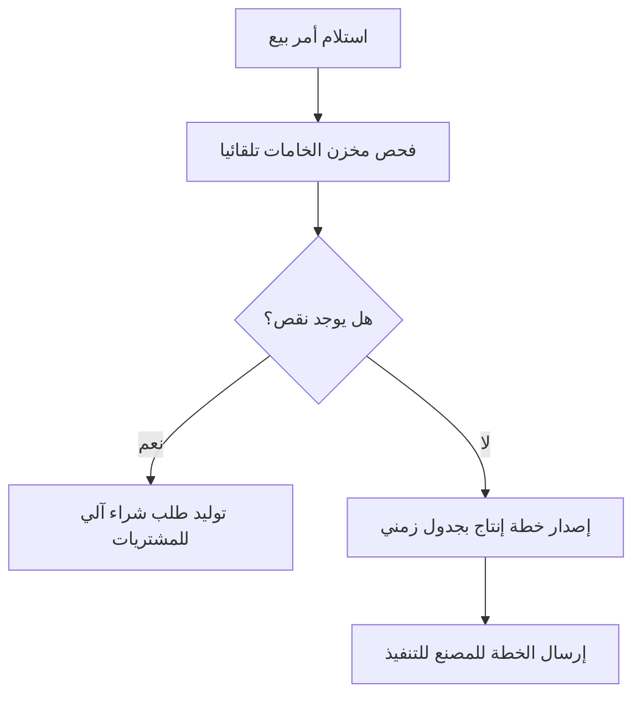

#### المميزات الحصرية للتخطيط:
- **توليد طلبات الشراء آلياً:** فور استكشاف أي نقص في الخامات لطلبية جديدة.

---

### 5. 🏭 قسم الإنتاج (Production)

#### المشكلة سابقاً:
سحب خامات عشوائي بدون إثبات، ولا يوجد فحص جودة قبل التخزين النهائي.

#### كيف يحل النظام المشكلة:

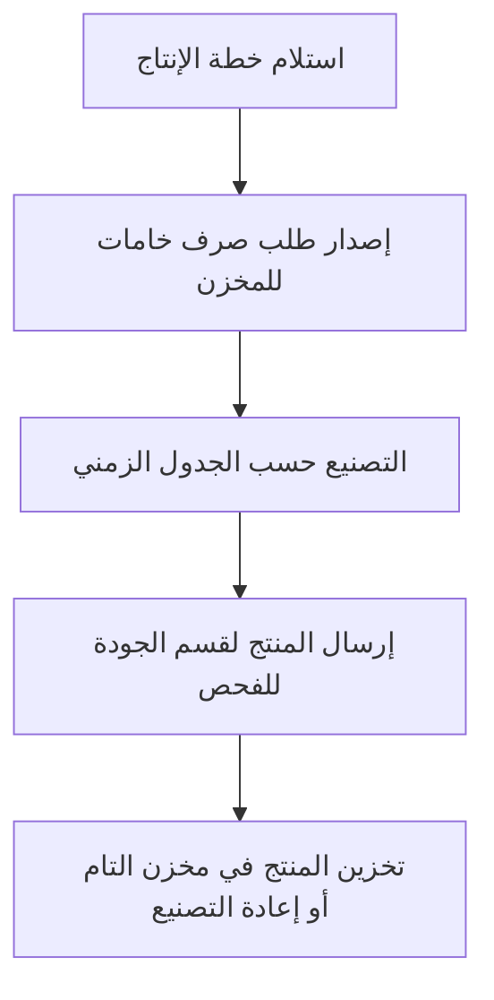

#### المميزات الحصرية للإنتاج:
- **دورة خامات محكمة:** لا تُصرف أي خامة إلا بطلب مسجل (Material Request).
- **الجودة أولاً:** المنتجات لا تدخل المخزن التام إلا بعد فحص قسم الجودة (QC).

---

### 6. ✅ قسم الجودة (Quality Control)

#### المشكلة سابقاً:
تخزين خامات موردين معيبة أو تسليم منتجات مصنع سيئة للعملاء.

#### كيف يحل النظام المشكلة:

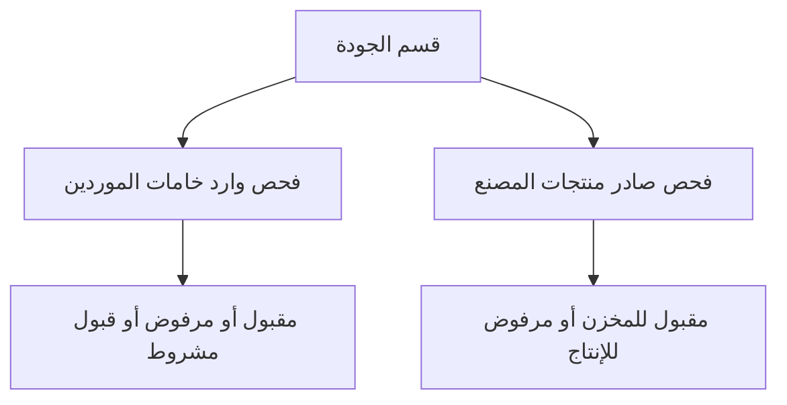

#### المميزات الحصرية للجودة:
- **صمام أمان:** يمنع دخول الخامات المعيبة للمصنع ويمنع خروج المنتجات المعيبة للعملاء.

---

### 7. 🏪 قسم المخازن (Warehouse)

#### المشكلة سابقاً:
عجز مفاجئ لعدم معرفة الأرصدة، وصرف بدون مستندات.

#### كيف يحل النظام المشكلة:

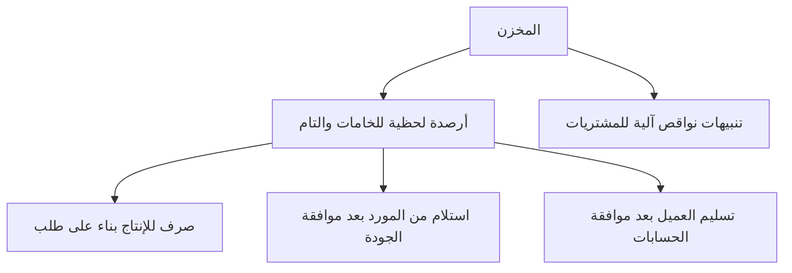

#### المميزات الحصرية للمخازن:
- **أرصدة لحظية وتنبيهات نواقص:** فور نزول الرصيد عن الحد الأدنى، يُرسل تنبيه للمشتريات.

---

### 8. 🛒 قسم المشتريات (Procurement)

#### المشكلة سابقاً:
شراء عشوائي بدون عروض أسعار، وتأخير تسوية الفواتير المالية.

#### كيف يحل النظام المشكلة:

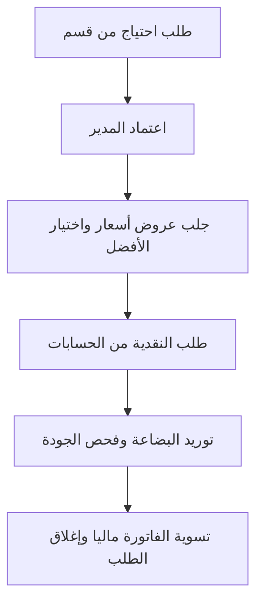

#### المميزات الحصرية للمشتريات:
- **مسار مالي منضبط:** الربط الكامل مع الإدارة المالية لتسوية العهد تلقائياً.

---

### 9. 🔧 الإدارة الهندسية وقطع الغيار (Engineering)

#### المشكلة سابقاً:
استهلاك غير مبرر لقطع الغيار وضياع التصميمات.

#### كيف يحل النظام المشكلة:

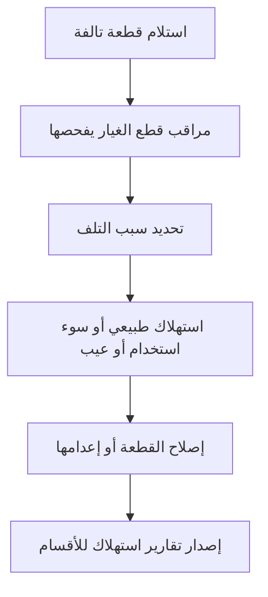

#### المميزات الحصرية للهندسة:
- **تحجيم إهدار قطع الغيار:** تحديد المسؤولية عن تلف الماكينات لتقليل الخسائر.

---

### 10. 💻 قسم الدعم الفني (IT Support)

#### المشكلة سابقاً:
طلبات شفهية للأعطال وتُنسى باستمرار.

#### كيف يحل النظام المشكلة:

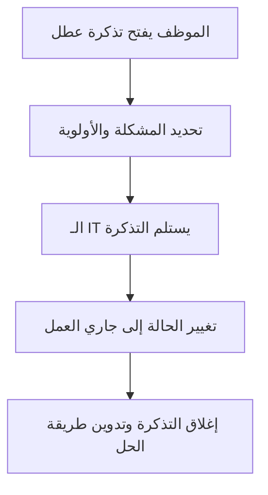

#### المميزات الحصرية للـ IT:
- **أرشيف معرفي للأعطال:** لعدم تكرار نفس الأخطاء وتسهيل الحل.

---

### 11. 🤖 الذكاء الاصطناعي (AI ATS & Chatbot)

#### المشكلة سابقاً:
فرز السير الذاتية بالعين يأخذ وقتاً طويلاً، وكثرة الأسئلة الروتينية للـ HR.

#### كيف يحل النظام المشكلة:

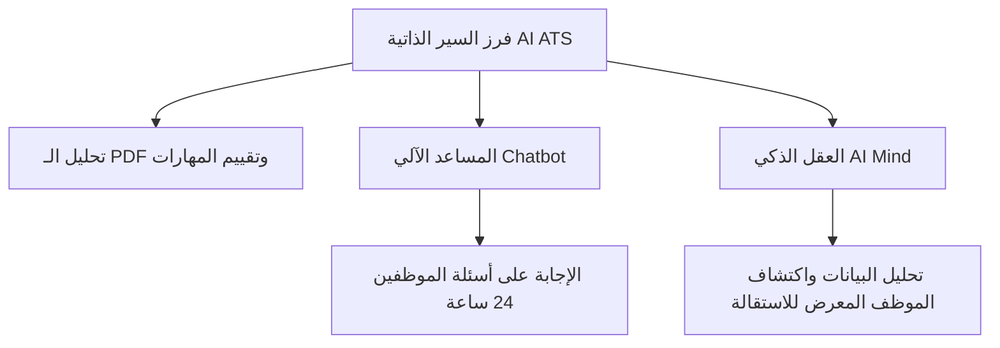

#### المميزات الحصرية للذكاء الاصطناعي:
- **أتمتة التوظيف:** فحص فوري للسير الذاتية ومنح تقييم من 100%.

---

### 12. 💬 التواصل وبيئة العمل (Collaboration)

#### المشكلة سابقاً:
التواصل عبر الواتساب الشخصي، والخلط بين الورديات.

#### كيف يحل النظام المشكلة:

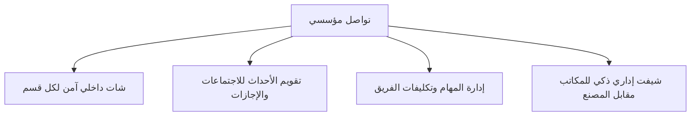

#### المميزات الحصرية لبيئة العمل:
- **شات داخلي مؤمن:** لا يعتمد على أرقام شخصية، وينشئ مجموعات تلقائية بناءً على القسم.

---

## 📊 ملخص الابتكار: قبل مقابل بعد

| الوظيفة | ❌ قبل (الوضع العشوائي) | ✅ بعد (نظام ERP الذكي) |
|:---|:---|:---|
| **الحضور والانصراف** | كشوف ورقية، وتوقيع الزملاء لبعضهم | مسح QR جغرافي يتغير كل 5 ثوانٍ |
| **الرواتب** | إكسيل مليء بالأخطاء وتجميع يدوي | حساب آلي بضغطة زر (أساسي + إضافي - خصومات) |
| **المخازن** | جرد يدوي وعجز مفاجئ للإنتاج | أرصدة لحظية، تنبيهات نواقص آلية لطلب الشراء |
| **المشتريات والعهد** | صرف نقدي عشوائي بدون تسويات | مسار آلي صارم ينتهي بتسوية الخزينة التلقائية |
| **الجودة** | منتجات تُسلم وخامات تُستلم بدون فحص | دورة فحص واردة وصادرة تمنع عيوب المنتجات |
| **قطع الغيار** | سحب غير مبرر وإهدار | دورة فحص للمراقب تحدد سبب التلف بدقة |
| **التوظيف** | قراءة السير الذاتية بالعين البند بالبند | ذكاء اصطناعي يحلل المهارات ويعطي قراراً بثوانٍ |
| **التواصل** | واتساب شخصي غير احترافي | شات داخلي مؤمن ومراقب، ونظام تذاكر لأعطال الـ IT |
| **تسليم العملاء** | تسليم بدون تأكيد الدفع | المخزن لا يسلم إلا بموافقة الحسابات، بتسجيل هوية المستلم |

> **نجح النظام في تحويل الشركة من جزر منعزلة إلى آلة ذكية ومترابطة؛ ضغطة زر في المبيعات تُسمِع آثارها فوراً في التخطيط، والمشتريات، والمخزن، والحسابات. مما يمنع الأخطاء البشرية، ويوقف إهدار الأموال، ويضاعف الأرباح.**
