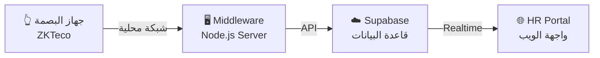

# 📋 خطة تطوير نظام Smart Factory HR Portal

---

## 📊 أولاً: تحليل الوضع الحالي

### ✅ الميزات الموجودة حالياً في المشروع:

| # | الميزة | الحالة |
|---|--------|--------|
| 1 | تسجيل دخول (Authentication) مع صلاحيات (HR / Employee / Manager) | ✅ شغال |
| 2 | لوحة تحكم (Dashboard) مع إحصائيات ورسوم بيانية (Chart.js) | ✅ شغال |
| 3 | إدارة الموظفين (إضافة / تعديل / حذف / عرض) | ✅ شغال |
| 4 | تسجيل حضور بـ QR Code (Check-In / Check-Out) | ✅ شغال |
| 5 | إدارة الإجازات (طلب / موافقة / رفض) + إيميل تلقائي | ✅ شغال |
| 6 | إدارة الورديات (2-Shift / 3-Shift) | ✅ شغال |
| 7 | إدارة الأوفرتايم (طلب / موافقة / رفض) | ✅ شغال |
| 8 | كشف المرتبات (Payroll) مع حساب تلقائي | ✅ شغال |
| 9 | الإعلانات (Announcements) | ✅ شغال |
| 10 | التقارير والتصدير CSV | ✅ شغال |
| 11 | سجل المراجعة (Audit Log) | ✅ شغال |
| 12 | الإشعارات (Notifications) في الوقت الحقيقي | ✅ شغال |
| 13 | دعم اللغة العربية والإنجليزية | ✅ شغال |
| 14 | تعديلات المرتبات (Salary Adjustments) - Manager & HR | ✅ شغال |
| 15 | قائمة الأوراق المطلوبة للموظفين | ✅ شغال |

---

## 🚀 ثانياً: الميزات الجديدة المقترح إضافتها

### 🔴 أولوية عالية (Must Have)

#### 1. 🔐 ربط نظام البصمة (Biometric System)
> **الوصف:** ربط جهاز بصمة (زي ZKTeco) بالنظام بحيث الحضور والانصراف يتسجل أوتوماتيك من البصمة بدل QR Code.

- **ليه مهم؟** لأن الـ QR ممكن حد يسجل لحد تاني، البصمة أأمن
- **التفاصيل الكاملة في القسم التالت** ⬇️

#### 2. 📄 نظام إدارة المستندات (Document Management)
> **الوصف:** السماح للـ HR برفع وتخزين مستندات الموظفين (عقود، بطاقات، شهادات)

```
المطلوب:
├── رفع ملفات (PDF / صور) لكل موظف
├── ربط كل ملف بنوع المستند (بطاقة / شهاده ميلاد / إلخ)
├── تخزين الملفات في Supabase Storage
└── عرض المستندات في بروفايل الموظف
```

**التعديل في قاعدة البيانات:**
```sql
CREATE TABLE employee_documents (
  id UUID DEFAULT uuid_generate_v4() PRIMARY KEY,
  employee_id UUID REFERENCES users(id) ON DELETE CASCADE,
  doc_type TEXT NOT NULL,        -- نوع المستند
  file_url TEXT NOT NULL,        -- رابط الملف في Supabase Storage
  file_name TEXT,
  uploaded_by TEXT,
  created_at TIMESTAMPTZ DEFAULT NOW()
);
```

#### 3. 📊 تقييم الأداء (Performance Management)
> **الوصف:** نظام تقييم شهري للموظفين مع KPIs

```
المطلوب:
├── إنشاء معايير تقييم (Criteria) لكل قسم
├── تقييم شهري من المدير
├── ربط التقييم بالمكافآت في Payroll
└── تقرير أداء سنوي
```

**التعديل في قاعدة البيانات:**
```sql
CREATE TABLE performance_reviews (
  id UUID DEFAULT uuid_generate_v4() PRIMARY KEY,
  employee_id UUID REFERENCES users(id) ON DELETE CASCADE,
  reviewer_id UUID REFERENCES users(id),
  month TEXT NOT NULL,
  attendance_score INTEGER DEFAULT 0,    -- من 100
  productivity_score INTEGER DEFAULT 0,  -- من 100
  teamwork_score INTEGER DEFAULT 0,      -- من 100
  overall_score INTEGER DEFAULT 0,       -- المتوسط
  comments TEXT,
  created_at TIMESTAMPTZ DEFAULT NOW()
);
```

---

### 🟡 أولوية متوسطة (Nice to Have)

#### 4. 💰 نظام السلف والقروض (Loans & Advances)
> **الوصف:** السماح للموظف بطلب سلفة وخصمها تلقائياً من المرتب

```
المطلوب:
├── طلب سلفة من الموظف
├── موافقة/رفض من HR
├── تحديد عدد الأقساط
└── خصم تلقائي من Payroll كل شهر
```

**التعديل في قاعدة البيانات:**
```sql
CREATE TABLE loans (
  id UUID DEFAULT uuid_generate_v4() PRIMARY KEY,
  employee_id UUID REFERENCES users(id) ON DELETE CASCADE,
  employee_name TEXT,
  amount NUMERIC(10,2) NOT NULL,
  installments INTEGER NOT NULL,          -- عدد الأقساط
  monthly_deduction NUMERIC(10,2),        -- القسط الشهري
  remaining NUMERIC(10,2),               -- المتبقي
  status TEXT DEFAULT 'pending',
  approved_by TEXT,
  created_at TIMESTAMPTZ DEFAULT NOW()
);
```

#### 5. 🎓 نظام التدريب (Training & Onboarding)
> **الوصف:** متابعة تدريبات الموظفين الجدد وشهادات السلامة

```
المطلوب:
├── إنشاء كورسات تدريبية (اسم + وصف + مدة)
├── تعيين كورسات لموظفين معينين
├── متابعة حالة الإكمال
└── تنبيه لما الشهادة تنتهي صلاحيتها
```

#### 6. 🏭 إدارة الأصول (Asset Management)
> **الوصف:** تتبع المعدات والأدوات المسلمة للموظفين

```
المطلوب:
├── تسجيل أصل جديد (اسم + رقم + حالة)
├── تسليم أصل لموظف (مع تاريخ)
├── استرجاع أصل (عند الاستقالة)
└── تقرير بالأصول المسلمة لكل موظف
```

---

### 🟢 أولوية منخفضة (Future)

#### 7. 📱 تطبيق موبايل (Mobile App)
- تحويل النظام لـ PWA (Progressive Web App)
- إشعارات Push على الموبايل

#### 8. 📧 نظام التوظيف (Recruitment / ATS)
- نشر وظائف شاغرة
- تتبع المتقدمين
- جدولة المقابلات

#### 9. 🔒 المصادقة الثنائية (2FA)
- إضافة طبقة أمان إضافية لتسجيل الدخول

---

## 🔐 ثالثاً: خطة ربط نظام البصمة (Biometric System)

### السيناريو 1: جهاز بصمة فعلي (ZKTeco أو مشابه) ← **الأنسب للمصنع**



#### الخطوات بالتفصيل:

**الخطوة 1: تجهيز الجهاز**
```
1. شراء جهاز بصمة يدعم TCP/IP (مثل ZKTeco K40 أو iClock)
2. توصيل الجهاز بشبكة المصنع (WiFi أو Ethernet)
3. تسجيل بصمات الموظفين على الجهاز
4. ربط كل بصمة بـ Employee ID الموجود في النظام
```

**الخطوة 2: إنشاء Middleware Server (وسيط)**

> هذا سيرفر صغير (Node.js) يشتغل على كمبيوتر في المصنع، وظيفته يسحب بيانات الحضور من جهاز البصمة ويبعتها لـ Supabase

```javascript
// middleware/biometric-sync.js
const ZKLib = require('node-zklib');   // مكتبة التواصل مع ZKTeco
const { createClient } = require('@supabase/supabase-js');

const supabase = createClient(
  'YOUR_SUPABASE_URL',
  'YOUR_SERVICE_ROLE_KEY'  // مفتاح الخدمة (مش الـ anon)
);

// إعدادات جهاز البصمة
const device = new ZKLib('192.168.1.201', 4370, 10000, 4000);

async function syncAttendance() {
  try {
    // 1. الاتصال بالجهاز
    await device.createSocket();

    // 2. سحب سجلات الحضور
    const logs = await device.getAttendances();

    // 3. لكل سجل، أضفه في Supabase
    for (const log of logs.data) {
      const employeeDeviceId = log.deviceUserId;
      const timestamp = log.recordTime;

      // البحث عن الموظف بالـ ID
      const { data: user } = await supabase
        .from('users')
        .select('id, full_name, department, shift')
        .eq('biometric_id', employeeDeviceId)
        .single();

      if (!user) continue;

      const today = timestamp.toISOString().split('T')[0];
      const timeStr = timestamp.toISOString();

      // التحقق: هل الموظف سجل حضور اليوم؟
      const { data: existing } = await supabase
        .from('attendance')
        .select('id, check_in')
        .eq('employee_id', user.id)
        .eq('date', today)
        .single();

      if (!existing) {
        // ✅ تسجيل حضور (Check-In)
        await supabase.from('attendance').insert({
          employee_id: user.id,
          employee_name: user.full_name,
          department: user.department,
          date: today,
          check_in: timeStr,
          shift: user.shift,
          status: 'checked_in',
          check_method: 'biometric'   // حقل جديد
        });
      } else if (!existing.check_out) {
        // ✅ تسجيل انصراف (Check-Out)
        const checkIn = new Date(existing.check_in);
        const hours = ((timestamp - checkIn) / 3600000).toFixed(2);
        await supabase.from('attendance').update({
          check_out: timeStr,
          working_hours: Number(hours),
          status: 'present'
        }).eq('id', existing.id);
      }
    }

    // 4. مسح السجلات من الجهاز (اختياري)
    // await device.clearAttendanceLog();

    await device.disconnect();
    console.log('✅ تم المزامنة بنجاح');
  } catch (err) {
    console.error('❌ خطأ في المزامنة:', err);
  }
}

// تشغيل المزامنة كل 5 دقائق
setInterval(syncAttendance, 5 * 60 * 1000);
syncAttendance(); // تشغيل فوري
```

**الخطوة 3: تعديلات قاعدة البيانات**

```sql
-- إضافة حقل رقم البصمة لجدول المستخدمين
ALTER TABLE users ADD COLUMN biometric_id TEXT;

-- إضافة حقل طريقة التسجيل لجدول الحضور
ALTER TABLE attendance ADD COLUMN check_method TEXT
  DEFAULT 'qr' CHECK (check_method IN ('qr', 'biometric', 'manual'));
```

**الخطوة 4: تعديل واجهة المستخدم**

```
التعديلات في app.js:
├── إضافة حقل "Biometric ID" في نموذج إضافة/تعديل الموظف
├── عرض طريقة التسجيل (QR / Biometric) في جدول الحضور
├── إضافة أيقونة بصمة 👆 في الـ Sidebar
└── صفحة إعدادات البصمة (للـ HR فقط)
```

---

### السيناريو 2: بصمة عبر المتصفح (WebAuthn) ← **للتسجيل من اللابتوب/الموبايل**

> هذا لو عايز الموظف يسجل حضوره ببصمة الموبايل أو اللابتوب (Touch ID / Face ID / Windows Hello)


#### الكود المطلوب في app.js:

```javascript
// ===== WEBAUTHN BIOMETRIC =====

// 1. تسجيل البصمة لأول مرة (Registration)
async function registerBiometric() {
  const challenge = new Uint8Array(32);
  crypto.getRandomValues(challenge);

  const credential = await navigator.credentials.create({
    publicKey: {
      challenge: challenge,
      rp: { name: "Smart Factory HR" },
      user: {
        id: new TextEncoder().encode(App.user.id),
        name: App.user.username,
        displayName: App.user.full_name
      },
      pubKeyCredParams: [
        { type: "public-key", alg: -7 },   // ES256
        { type: "public-key", alg: -257 }  // RS256
      ],
      authenticatorSelection: {
        authenticatorAttachment: "platform",  // بصمة الجهاز نفسه
        userVerification: "required"
      }
    }
  });

  // حفظ المفتاح العام في Supabase
  const credentialId = btoa(
    String.fromCharCode(...new Uint8Array(credential.rawId))
  );
  await sbClient.from('user_credentials').insert({
    user_id: App.user.id,
    credential_id: credentialId,
    public_key: JSON.stringify(credential.response)
  });

  showToast('✅ تم تسجيل البصمة بنجاح!', 'success');
}

// 2. التحقق بالبصمة (Authentication / Check-In)
async function authenticateWithBiometric() {
  const { data: creds } = await sbClient
    .from('user_credentials')
    .select('credential_id')
    .eq('user_id', App.user.id);

  if (!creds || creds.length === 0) {
    alert('لم يتم تسجيل بصمة. سجل البصمة أولاً.');
    return false;
  }

  const challenge = new Uint8Array(32);
  crypto.getRandomValues(challenge);

  const assertion = await navigator.credentials.get({
    publicKey: {
      challenge: challenge,
      allowCredentials: creds.map(c => ({
        type: "public-key",
        id: Uint8Array.from(atob(c.credential_id), c => c.charCodeAt(0))
      })),
      userVerification: "required"
    }
  });

  // لو نجحت البصمة → سجل الحضور
  if (assertion) {
    // نفس كود تسجيل الحضور الموجود في QR Check-In
    return true;
  }
  return false;
}
```

**جدول قاعدة بيانات إضافي:**
```sql
CREATE TABLE user_credentials (
  id UUID DEFAULT uuid_generate_v4() PRIMARY KEY,
  user_id UUID REFERENCES users(id) ON DELETE CASCADE,
  credential_id TEXT NOT NULL,
  public_key TEXT NOT NULL,
  created_at TIMESTAMPTZ DEFAULT NOW()
);
```

---

## 📅 رابعاً: الجدول الزمني المقترح

| المرحلة | الميزة | المدة المقترحة |
|---------|--------|----------------|
| **المرحلة 1** | ربط نظام البصمة (Middleware + DB) | 3-5 أيام |
| **المرحلة 2** | نظام إدارة المستندات | 2-3 أيام |
| **المرحلة 3** | نظام تقييم الأداء | 3-4 أيام |
| **المرحلة 4** | نظام السلف والقروض | 2-3 أيام |
| **المرحلة 5** | نظام التدريب | 2-3 أيام |
| **المرحلة 6** | إدارة الأصول | 2 أيام |

> **الإجمالي المقدر: 14-20 يوم عمل**

---

## ⚙️ خامساً: ملخص التعديلات التقنية المطلوبة

### ملفات جديدة:
```
HR portal/
├── middleware/
│   └── biometric-sync.js          ← سيرفر مزامنة البصمة
├── js/
│   ├── biometric.js               ← كود WebAuthn
│   ├── documents.js               ← إدارة المستندات
│   ├── performance.js             ← تقييم الأداء
│   └── loans.js                   ← نظام السلف
└── supabase_schema_v2.sql         ← التحديثات على قاعدة البيانات
```

### تعديلات على ملفات موجودة:
```
├── portal.html     → إضافة script tags جديدة
├── js/app.js       → إضافة صفحات جديدة في Router + Sidebar
├── js/constants.js → إضافة ثوابت جديدة
└── css/styles.css  → أنماط للصفحات الجديدة
```

---

## ❓ أسئلة محتاجين نحددها قبل البدء

> [!IMPORTANT]
> 1. **نوع جهاز البصمة:** هل عندك جهاز بصمة معين (ZKTeco؟ Suprema؟) ولا لسه هتشتري؟
> 2. **الأولوية:** تحب نبدأ بأي ميزة الأول؟
> 3. **البصمة عبر المتصفح:** هل تحب نضيف WebAuthn كمان (بصمة الموبايل) بجانب جهاز البصمة؟
> 4. **هل تحب نبدأ ننفذ دلوقتي ولا عندك تعديلات على الخطة؟**
