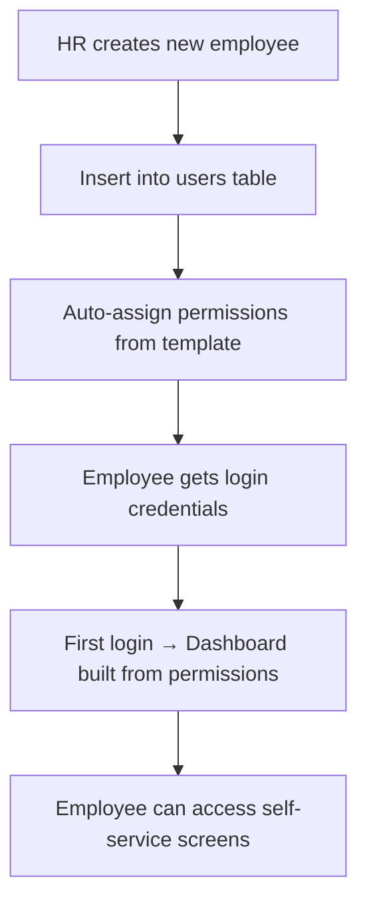
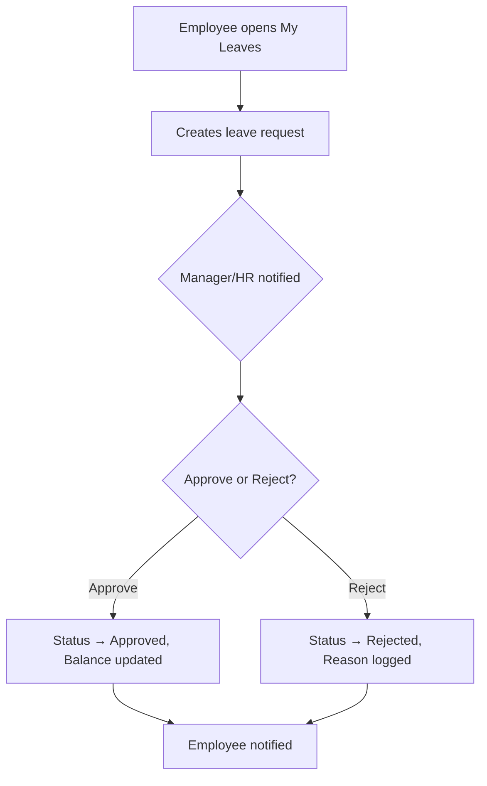
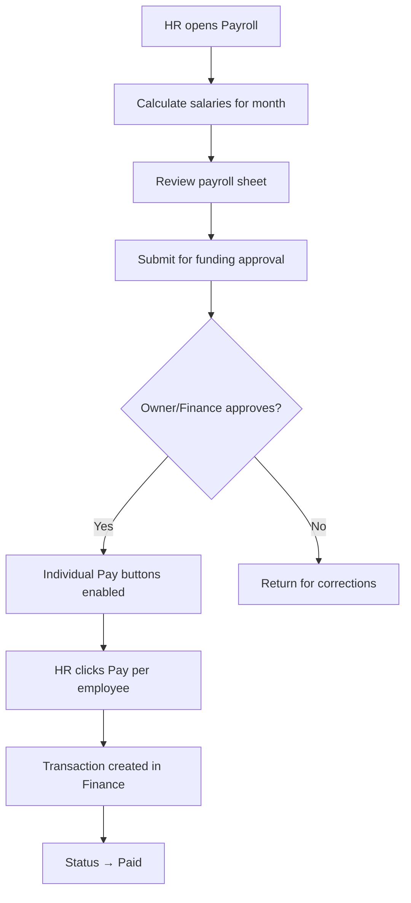
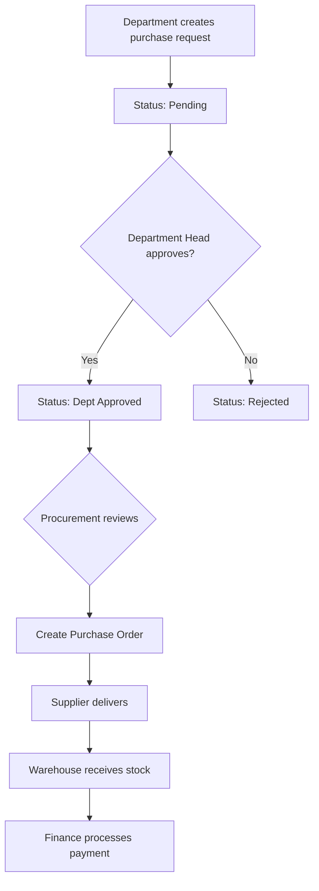
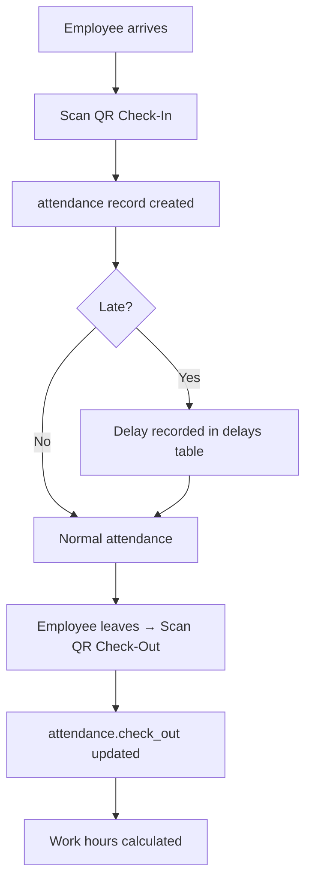
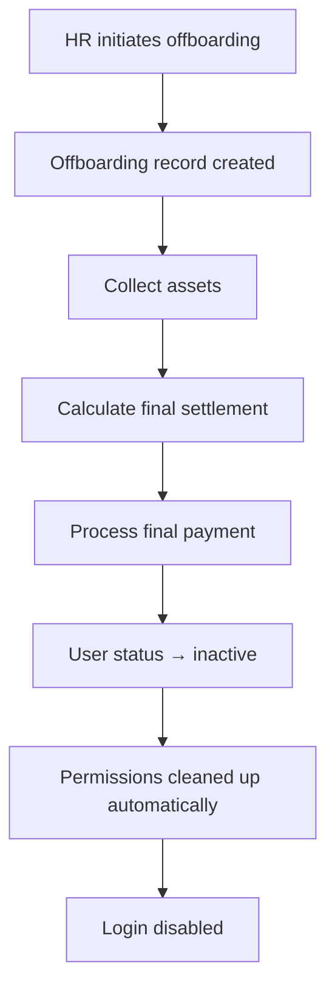
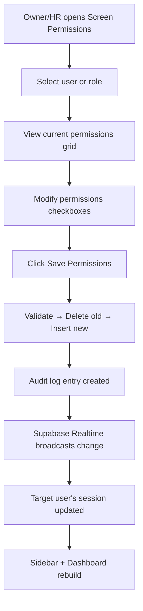
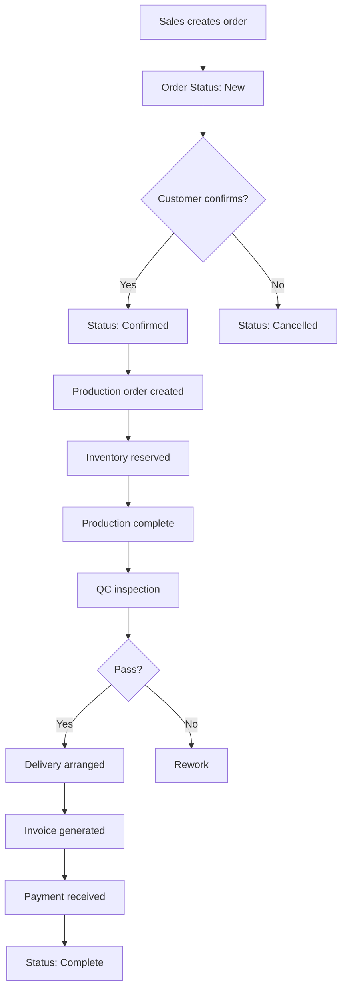
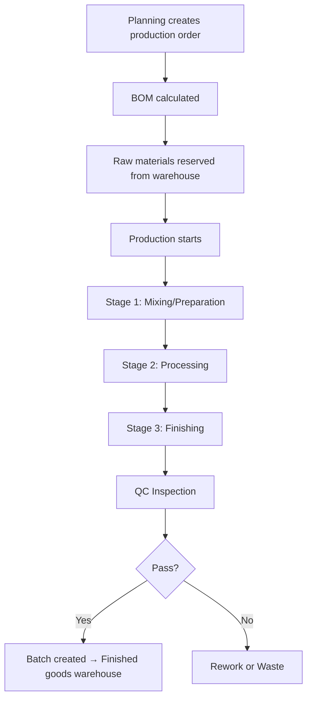
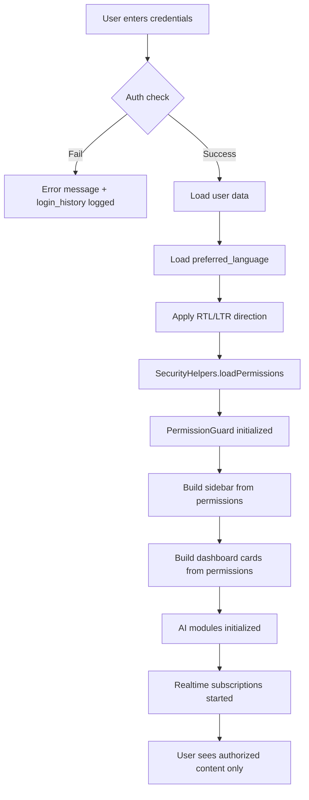

# Business Workflows — Ninja Factory ERP

## 1. Employee Onboarding Workflow

## 2. Leave Request Workflow

**Permissions Required:**
- Employee: `my-leaves.view`, `my-leaves.create`
- Manager/HR: `leaves.view`, `leaves.approve`, `leaves.reject`

## 3. Payroll Workflow

**Permissions Required:**
- HR: `payroll.view`, `payroll.create`, `payroll.export`
- Finance: `payroll-funding.view`, `payroll-funding.approve`
- Owner: Full access

## 4. Purchase Request Workflow

**Permissions Required:**
- Employee: `purchase-requests.create`
- Dept Head: `dept-purchase-approvals.approve`
- Procurement: `purchase-requests.view`, `purchase-requests.approve`
- Warehouse: `inventory.create`
- Finance: `petty-cash.create`

## 5. Attendance Workflow

**Permissions Required:**
- Employee: `scan-checkin.view`, `scan-checkout.view`
- HR: `attendance.view`, `attendance.export`

## 6. Employee Offboarding Workflow

**Permissions Required:**
- HR: `offboarding.view`, `offboarding.create`, `offboarding.edit`
- Finance: `payroll.create` (final settlement)

## 7. Permission Change Workflow

## 8. Sales Order Workflow

**Permissions Required:**
- Sales: `erp-sales.view`, `erp-sales.create`, `erp-sales.edit`
- Production: `erp-production.create`
- QC: `erp-quality.create`
- Finance: `petty-cash.create`

## 9. Production Workflow

## 10. Login → Dashboard Flow

